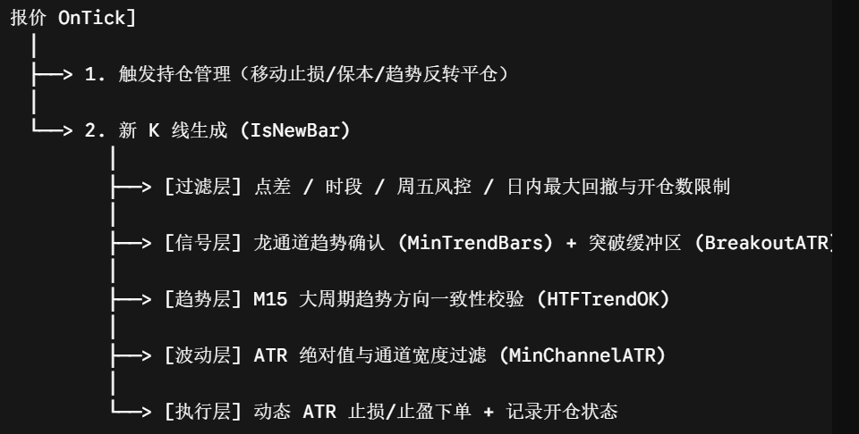

# DragonChannel EA (XAUUSD M5 Institutional Edition)

## 1. EA 概述

**DragonChannel_XAUUSD_M5_Institutional** 是一款专门针对 **XAUUSD（黄金）5分钟图表 (M5)** 设计的高频趋势跟踪型自动化交易系统（Expert Advisor）。

本策略融合了机构级风控理念，以动态通道突破为核心驱动力，搭配多时间周期（HTF）趋势对齐、ATR 波动率自适应防线以及严格的日内净值回撤保护机制。EA 在每个 K 线收盘时进行信号确认（Closed-bar execution），旨在有效捕捉黄金高波动趋势行情的同时，严格剔除震荡噪声与假突破。

---

## 2. 核心实现原理

### 2.1 趋势识别与通道突破
系统依赖自定义 `DragonChannel` 指标的缓冲区数据，实时判断市场处于 **多头 (UP)**、**空头 (DOWN)** 或 **震荡 (SIDEWAYS)** 状态：
- **多头判定**：主快线（Line1、Line2）均位于通道上轨（su/sl）上方。
- **空头判定**：主快线（Line1、Line2）均位于通道下轨（su/sl）下方。
- **突破确认**：前一收盘价（Bar 1）必须以一定的 ATR 比例（`InpBreakoutATR`）实体突破通道边界，且此前处于通道内部，以确保突破的有效性。

### 2.2 多时间周期（HTF）二次过滤
为了防止“小周期突破、大周期逆势”的情况，EA 在 M5 信号触发时会调用 M15 周期进行趋势对齐：
- **做多条件**：M15 K 线呈上涨状态，且当前 M5 收盘价不低于 M15 参照价格减去 $0.10 \times \text{HTF ATR}$。
- **做空条件**：M15 K 线呈下跌状态，且当前 M5 收盘价不高于 M15 参照价格加上 $0.10 \times \text{HTF ATR}$。

### 2.3 ATR 自适应风控与出场管理
策略摒弃了传统的固定点数止损，全部基于 14 周期 ATR 进行自适应风险控制：
- **动态止损 (SL)**：开仓同时根据当前波幅设定 $1.8 \times \text{ATR}$ 的初始止损。
- **保本触发 (Break-Even)**：当浮盈达到 $1.0 \times \text{ATR}$ 时，自动将止损拉至开仓价微调位置（覆盖点差与手续费）。
- **移动止损 (Trailing Stop)**：当浮盈达到 $1.2 \times \text{ATR}$ 后，开启追踪止损，保持 $1.4 \times \text{ATR}$ 的追踪距离。
- **离场机制**：若通道检测到行情进入 **震荡 (Sideways)** 或 **趋势反转 (Trend Flip)**，EA 会主动市价平仓离场。

### 2.4 机构级风控与风控墙
- **日内最大回撤保护**：监控每日开盘净值，一旦日内回撤达到 `InpMaxDailyLossPct`（默认 3.0%），将立刻停止当日所有新开仓。
- **周五避险**：支持周五晚间指定时间（如 20:30）后停止开仓，防止跨周跳空风险。
- **冷却周期**：开仓后强制冷却指定 K 线数量（`InpCooldownBars`），防止在极短时间内连续开仓。

---

## 3. 参数配置手册

### 3.1 核心基础配置 (Core)
| 参数名称 | 数据类型 | 默认值 | 说明 |
| :--- | :--- | :--- | :--- |
| `InpLots` | `double` | `0.10` | 交易手股大小 |
| `InpMagic` | `ulong` | `25090501` | 策略唯一识别码 |
| `InpDeviationPoints` | `int` | `30` | 允许的最大执行滑点（点） |
| `InpOnlyXAUUSD` | `bool` | `true` | 是否限定黄金品种（XAUUSD/GOLD） |
| `InpOnlyM5` | `bool` | `true` | 是否限定 M5 图表 |

### 3.2 通道信号配置 (DragonChannel)
| 参数名称 | 数据类型 | 默认值 | 说明 |
| :--- | :--- | :--- | :--- |
| `InpDragonName` | `string` | `"DragonChannel"` | 指标文件名（保存在 `Indicators` 目录） |
| `InpMinTrendBars` | `int` | `2` | 趋势确认所需的最小闭合 K 线数 |
| `InpRequireBreakout` | `bool` | `true` | 是否要求实体突破通道 |
| `InpBreakoutATR` | `double` | `0.05` | 突破缓冲区系数（$ATR \times x$） |

### 3.3 ATR 风险管理 (ATR Risk)
| 参数名称 | 数据类型 | 默认值 | 说明 |
| :--- | :--- | :--- | :--- |
| `InpATRPeriod` | `int` | `14` | M5 ATR 计算周期 |
| `InpSL_ATR` | `double` | `1.8` | 初始止损系数（$ATR \times x$） |
| `InpTP_ATR` | `double` | `0.0` | 止盈系数（`0` 表示不设固定止盈，依靠追踪平仓） |
| `InpTrailStartATR` | `double` | `1.2` | 触发追踪止损的最小盈利系数 |
| `InpTrailATR` | `double` | `1.4` | 追踪止损跟进距离系数 |
| `InpBreakEvenATR` | `double` | `1.0` | 触发保本止损的盈利系数 |
| `InpBEOffsetATR` | `double` | `0.10` | 保本微调偏移量系数（覆盖点差） |

### 3.4 趋势与波动率过滤 (Trend Confirmation)
| 参数名称 | 数据类型 | 默认值 | 说明 |
| :--- | :--- | :--- | :--- |
| `InpUseHTF` | `bool` | `true` | 是否开启大周期趋势过滤 |
| `InpHTF` | `ENUM_TIMEFRAMES` | `PERIOD_M15` | 大周期过滤时间帧（默认 M15） |
| `InpHTF_ATRPeriod` | `int` | `14` | 大周期 ATR 计算周期 |
| `InpMinChannelATR` | `double` | `0.20` | 最小通道宽度系数（低于此值判定为狭窄盘整） |
| `InpMinATRPoints` | `double` | `0.0` | 开仓所需最小波动点数（`0` 为不限制） |

### 3.5 交易执行与过滤 (Trading Filters)
| 参数名称 | 数据类型 | 默认值 | 说明 |
| :--- | :--- | :--- | :--- |
| `InpMaxSpreadPoints` | `double` | `80` | 最大允许点差（Points） |
| `InpCooldownBars` | `int` | `2` | 两次开仓之间的最小 K 线间隔 |
| `InpMaxPositions` | `int` | `1` | 最大同时持仓单数 |
| `InpCloseOnSideways` | `bool` | `true` | 行情转为震荡时是否主动平仓 |
| `InpCloseOnTrendFlip` | `bool` | `true` | 趋势反转时是否主动平仓 |
| `InpNoFridayLate` | `bool` | `true` | 周五晚间是否禁止开仓 |
| `InpFridayStopHour` | `int` | `20` | 周五停止开仓服务器小时数 |
| `InpFridayStopMinute` | `int` | `30` | 周五停止开仓服务器分钟数 |

### 3.6 机构级日内保护 (Daily Protection)
| 参数名称 | 数据类型 | 默认值 | 说明 |
| :--- | :--- | :--- | :--- |
| `InpMaxDailyLossPct` | `double` | `3.0` | 每日最大净值回撤百分比限额 (%) |
| `InpMaxTradesPerDay` | `int` | `12` | 单日最大允许交易次数（`0` 表示不限制） |
| `InpBlockAfterDailyLoss`| `bool` | `true` | 触及日内最大亏损后是否冻结当日新开仓 |

### 3.7 交易时段控制 (Session)
| 参数名称 | 数据类型 | 默认值 | 说明 |
| :--- | :--- | :--- | :--- |
| `InpUseSession` | `bool` | `false` | 是否开启指定时间段交易 |
| `InpSessionStartHour` | `int` | `7` | 开始交易小时 |
| `InpSessionStartMinute` | `int` | `0` | 开始交易分钟 |
| `InpSessionEndHour` | `int` | `23` | 结束交易小时 |
| `InpSessionEndMinute` | `int` | `30` | 结束交易分钟 |

---

## 4. 安装与使用说明

1. **安装指标**：
   将 `DragonChannel.mq5` 编译后的 `DragonChannel.ex5` 文件放入 MT5 客户端的 `MQL5/Indicators/` 目录下。
2. **安装 EA**：
   将 `DragonChannel_XAUUSD_M5_Institutional.mq5` 复制到 `MQL5/Experts/` 目录下，并在 MetaEditor 中点击**编译 (Compile)**。
3. **挂载图表**：
   打开 **XAUUSD (GOLD)** 的 **M5 (5分钟)** 图表，将 EA 拖入图表中。
4. **开启自动交易**：
   在 EA 属性弹窗的“普通 (Common)”选项卡中勾选 **“允许算法交易 (Allow Algo Trading)”**，并确保 MT5 终端主界面的“算法交易”按钮处于开启状态。

---

## 5. 风控与使用建议

- **资金管理**：建议账户起始资金不少于 $1,000，初始手数设为 `0.01` ~ `0.10` 手，并根据账户承受能力调整 `InpMaxDailyLossPct`。
- **点差检查**：黄金在美盘开盘及清算时段（北京时间 04:00 - 06:00）点差可能剧烈扩大，请确保 `InpMaxSpreadPoints` 保持在合理的保护范围内（如 80 点以内）。
- **复盘与回测**：回测时请选择 **“基于真实 Tick 的每个 Tick”** 模式，以获得最精准的 ATR 移动止损与点差模拟效果。